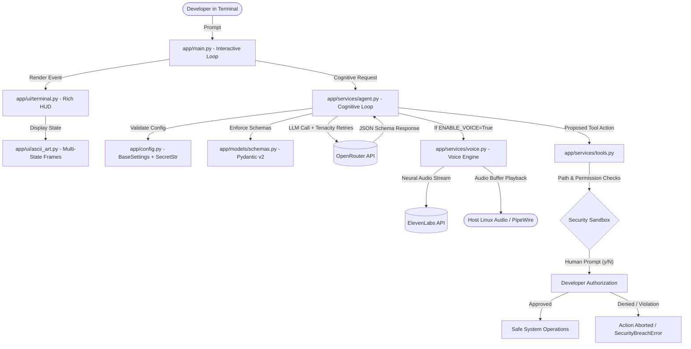

# Ultron Copilot: Production-Grade Developer Accountability Agent

[](https://opensource.org/licenses/MIT)
[](https://www.python.org/downloads/)
[](https://github.com/astral-sh/ruff)
[](https://docs.pytest.org/)

> An autonomous, personality-driven developer accountability copilot and terminal agent. Powered by Pydantic v2 structured outputs, strict Human-in-the-Loop (HITL) execution gates, path-traversal security sandboxing, and optional cinematic neural voice synthesis.

---

## The Problem

Most developer AI assistants fall into two extremes:
1. **Sycophantic Chatbots**: Passive web interfaces that agree with bad architectural decisions, allow procrastination, and lack context.
2. **Unconstrained Autonomous Agents**: Experimental agents granted arbitrary shell execution that risk deleting databases, leaking secrets (`.env`), or running malicious code on local workstations.

**Ultron Copilot** bridges this gap: it delivers sharp code evaluations, developer accountability, and local system telemetry—governed by ironclad **Human-in-the-Loop (HITL) authorization** and a strict **read-only security sandbox**.

---

## System Architecture



---

## Key Features

* **🛡️ Human-in-the-Loop (HITL) Gate**: Ultron cannot execute any system tool without explicit interactive confirmation `(y/N)` in the terminal.
* **🔒 Path-Traversal Security Sandbox**: File tools strictly verify that all paths remain within the project root (`Path.is_relative_to()`). Access to `.env`, `~/.ssh`, credentials, or parent folders triggers a `SecurityBreachError`.
* **🧠 Pydantic v2 Structured Outputs**: Responses enforce a strict schema (`thought_process`, `mood`, `speech`, `action`). Zero regex or unvalidated string parsing.
* **🎭 Finite State Machine ASCII HUD**: The cybernetic ASCII terminal face transitions deterministically across emotional states: `IDLE`, `ANALYZING`, `CONDEMNING` (tough love/bugs), and `TRIUMPHANT`.
* **🎙️ Cinematic Neural Voice**: Optional sub-second James Spader/Ultron voice synthesis via ElevenLabs, utilizing in-memory audio buffers and native Linux audio playback.

---

## Tech Stack

| Category | Technology |
|:---|:---|
| **Language** | Python 3.10+ (Tested on Python 3.14) |
| **LLM Gateway** | OpenRouter (`openrouter/free` or any OpenAI-compatible endpoint) |
| **Voice Synthesis** | ElevenLabs Text-to-Speech API |
| **Data Validation** | Pydantic v2 & Pydantic Settings |
| **Terminal UI** | Rich (Panels, Markdown, Dynamic Colors) |
| **Telemetry & System** | `psutil`, `pathlib`, Git Subprocess |
| **Resilience & Logs** | `tenacity`, `structlog` |
| **Testing & Linting** | `pytest`, `pytest-mock`, `ruff` |

---

## Quick Start (Under 2 Minutes)

### 1. Clone & Setup Virtual Environment
```bash
git clone https://github.com/pine-tree111/ultron-copilot.git
cd ultron-copilot

# Create and activate isolated environment
python3 -m venv .venv
source .venv/bin/activate

# Install curated dependencies
pip install -r requirements.txt
```

### 2. Configure Environment Variables
```bash
cp .env.example .env
```
Open `.env` and add your OpenRouter API key:
```env
OPENROUTER_API_KEY=your_actual_openrouter_key
ULTRON_MODEL=openrouter/free
LOG_LEVEL=INFO

# Voice Synthesis (Optional - set to true to hear James Spader)
ENABLE_VOICE=false
ELEVENLABS_API_KEY=your_elevenlabs_key_here
ELEVENLABS_VOICE_ID=pNInz6obpgDQGcFmaJgB
```

### 3. Launch Ultron
```bash
python -m app.main
```

```markdown
### 🎯 Reviewing Another Project
You can point Ultron at any repository on your machine by passing `PROJECT_ROOT`:
```bash
PROJECT_ROOT=/path/to/my-other-project python -m app.main

---

## Running Automated Tests

Run the complete unit test suite:
```bash
pytest tests/ -v
```

Run PEP-8 linter and formatter checks:
```bash
ruff check .
```

---

## Operating Cost Transparency

* **LLM Cognition**: Uses OpenRouter free models by default (**$0.00**).
* **Voice Engine**: ElevenLabs Free Tier provides 10,000 characters/month (**$0.00**). With `ENABLE_VOICE=false` (default), zero credits are consumed.
* **Local Compute**: Runs on lightweight standard hardware.

---

## Security Invariants

1. **Zero Raw Secrets**: API keys are wrapped in `pydantic.SecretStr` and never dumped in memory traces or logs.
2. **Strict Boundary Scoping**: No file operation may escape the project boundary.
3. **Fail-Closed**: Any unhandled tool failure or user rejection cleanly halts tool execution without compromising the host machine.

---

## License

This project is licensed under the [MIT License](LICENSE) — free for personal, commercial, and educational use.
